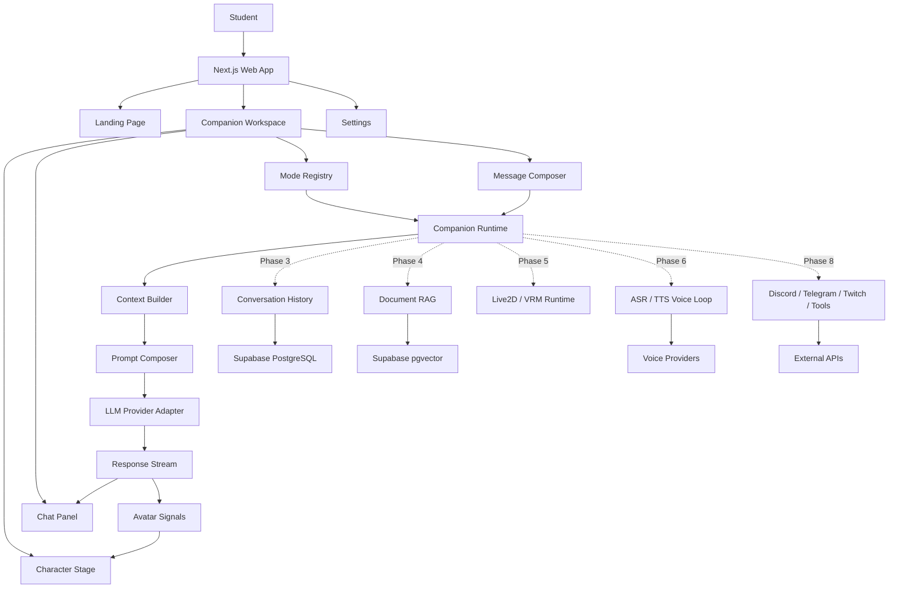
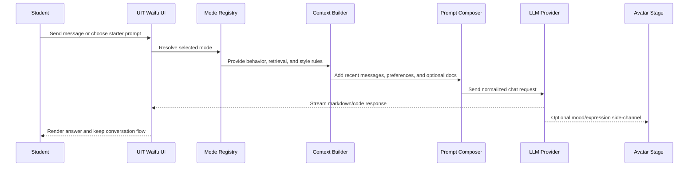

# Reference Project Study

This document records reusable design, architecture, and product lessons from adjacent open-source AI companion, VTuber, avatar, and agent projects. Use it as guidance for future UIT Waifu phases, not as a mandate to copy another project's code or assets.

Research date: 2026-06-25

## How To Use This Document

- Use these projects as architecture and UX references before starting major companion, avatar, voice, streaming, RAG, or agent work.
- Borrow patterns at the boundary level: event flow, module shape, prompt routing, model-provider abstraction, avatar control, and deployment structure.
- Do not copy private assets, secrets, personality files, model weights, or code with incompatible licenses.
- Keep UIT Waifu web-first. Desktop, Twitch, Discord, Minecraft, WebXR, Live2D, and autonomous agent behavior should arrive only after the chat and academic workflows are stable.


## Open-Source Reference Map

| Project | Best lesson | Observed shape | Apply to UIT Waifu | Caution |
| --- | --- | --- | --- | --- |
| [kimjammer/Neuro](https://github.com/kimjammer/Neuro) | Complete realtime VTuber loop built quickly | Python backend with STT, TTS, LLM wrapper, shared signal state, modules, memory/RAG, VTube Studio control, socket.io frontend bridge | Use an explicit event pipeline for voice/avatar later: input -> state -> prompt composer -> model -> output -> avatar/UI | Hardware-heavy local setup; moderation must be stronger for public use |
| [SugarcaneDefender/z-waif](https://github.com/SugarcaneDefender/z-waif) | Personal companion with local modules and long-term memory | Python local app with WebUI, VTube Studio, Discord, Minecraft, custom RAG database, logs, hotkeys, modules | Add feature toggles and memory controls early; design RAG as a user-visible companion feature, not just backend plumbing | Easy to overload MVP with too many modules |
| [semperai/amica](https://github.com/semperai/amica) | Browser-based 3D character companion UX | TypeScript/Next-style app, VRM support, speech recognition, voice synthesis, vision, emotion engine, desktop packaging | Best reference for future VRM/WebXR-like avatar panel and emotion-to-expression mapping | VRM/WebXR scope is too large for Phase 1 |
| [elizaOS/eliza](https://github.com/elizaOS/eliza) | Agent platform engineering and plugin boundaries | TypeScript monorepo with runtime, CLI, web UI, connectors, plugins, model-agnostic providers, RAG/document ingestion | Borrow the idea of actions, providers, services, connectors, and a model-agnostic runtime once UIT Waifu grows beyond chat | Do not embed the full framework unless the project intentionally becomes an agent platform |
| [ardha27/AI-Waifu-Vtuber](https://github.com/ardha27/AI-Waifu-Vtuber) | Streaming/Twitch integration and simple VTuber pipeline | Python app with voice input, OpenAI-era chat flow, VoiceVox/Silero TTS, translation, Twitch IRC config, OBS text outputs | Future streaming mode can expose transcript and response text outputs for OBS and connect to chat providers through a safe adapter | Uses legacy OpenAI APIs and config examples that should not be copied directly |
| [InsanityLabs/AIVTuber](https://github.com/InsanityLabs/AIVTuber) | Simple Live2D/VTube Studio UX direction | JavaScript/Node app with Live2D/VTube Studio plugin notes and TTS focus | Good lightweight reference for "avatar reacts to app output" before full VRM/Live2D systems | Small project; use as UI inspiration, not architecture foundation |
| [IRedDragonICY/vixevia](https://github.com/IRedDragonICY/vixevia) | Multimodal VTuber concept with Gemini and vision | Python app focused on Gemini, speech, TTS, computer vision, and personalized virtual personality | Keep a future visual-perception path: camera/screen/document image -> vision model -> context builder -> response | Hardware/API-key requirements are high; vision should be opt-in |
| [Open-LLM-VTuber/Open-LLM-VTuber](https://github.com/Open-LLM-VTuber/Open-LLM-VTuber) | Most complete open local AI VTuber/companion direction | Python backend plus frontend/assets with Live2D, voice interruption, ASR/TTS provider matrix, offline mode, desktop pet mode, modular config | Strongest long-term reference for voice, Live2D expressions, local/offline model support, and desktop companion modes | Its v2 rewrite planning means APIs and architecture may shift |
| [PeterH0323/Streamer-Sales](https://github.com/PeterH0323/Streamer-Sales) | Production-style AI pipeline with frontend/backend/services | Python/FastAPI backend, Vue frontend, PostgreSQL, RAG, ASR, TTS, digital human generation, Docker Compose, agent web queries | Reference for later production architecture: separate services, REST APIs, database-backed workflows, Docker deployment, RAG docs | Domain is sales, not academic companion; adapt structure, not persona |

## Architecture Lessons To Keep

### 1. Build A Companion Runtime Boundary

Phase 1 can stay simple, but the project should reserve a clean boundary for a future runtime:

```txt
UI event
  -> mode router
  -> context builder
  -> prompt composer
  -> model provider
  -> response stream
  -> UI renderer
  -> optional avatar/voice/action side effects
```

This keeps the chat MVP from becoming tangled when voice, RAG, memory, tools, and avatar reactions are added.

### 2. Treat Modes As Runtime Behavior

Modes should do more than change labels. Each mode should be able to define:

- Starter prompts.
- System prompt fragments.
- Retrieval behavior.
- Tool permissions.
- Avatar mood hints.
- Output style rules.

Current Phase 1 mode work should evolve into a small mode registry before becoming a full agent/plugin system.

### 3. Use A Thin Provider Layer

Several references support many model, ASR, and TTS providers. UIT Waifu should keep the same idea:

```txt
ChatProvider
  -> OpenRouter
  -> Anthropic-compatible endpoint
  -> OpenAI-compatible endpoint
  -> future local model endpoint

VoiceProvider later
  -> browser speech
  -> Whisper-compatible ASR
  -> Edge/Azure/OpenAI/Fish/etc. TTS
```

Provider code should hide secrets, normalize errors, and keep UI components independent from vendor-specific request shapes.

### 4. Make Memory User-Controlled

Neuro, z-waif, Open-LLM-VTuber, eliza, and Streamer-Sales all point toward memory/RAG as a core feature. UIT Waifu should implement it with student trust first:

- Short-term session context first.
- Explicit saved preferences next.
- Conversation history with delete/export controls.
- Document RAG with source display.
- Long-term memory only after user controls are clear.

### 5. Separate Avatar Signal From Chat Text

Future avatar systems should not scrape assistant text to guess emotion. The assistant runtime should produce structured side-channel hints:

```json
{
  "spoken_text": "Here is the answer...",
  "display_markdown": "Here is the answer...",
  "avatar": {
    "mood": "focused",
    "expression": "thinking",
    "motion": "idle"
  }
}
```

For Phase 1, this can be simulated with message state. Later, it can drive Live2D, VRM, or desktop pet behavior.

## Recommended UIT Waifu Target Architecture



## Recommended Feature Flow



## Phase Guidance From The References

### Phase 1: Landing Page And Chat MVP

Keep:

- Fast entry into `/waifu/chat`.
- Strong character/stage signal.
- Mode selector with real starter prompts.
- Markdown/code response rendering.
- Safe provider errors and no leaked secrets.

Avoid:

- Full Live2D/VRM integration.
- Twitch/Discord/Minecraft integrations.
- Autonomous tool execution.
- Heavy local model requirements.

### Phase 2: Study And Code Modes

Borrow from eliza and Neuro:

- Mode-specific prompt injection.
- A small action/tool boundary for future use.
- Clear response contracts for code, study plans, and revision.

### Phase 3: Account, History, Preferences

Borrow from Open-LLM-VTuber and z-waif:

- Persistent conversation history.
- User-controlled companion preferences.
- Delete/export controls before long-term memory.

### Phase 4: Documents And RAG

Borrow from Streamer-Sales, eliza, Neuro, and z-waif:

- Document ingestion pipeline.
- Chunking, embeddings, pgvector retrieval.
- Source-aware answers.
- Retrieval toggles by mode.

### Phase 5: Character Runtime

Borrow from amica, Open-LLM-VTuber, AIVTuber, and Neuro:

- Avatar state as structured signals.
- Emotion-to-expression mapping.
- Idle, thinking, speaking, and error states.
- Browser-first implementation before desktop pet mode.

### Phase 6+: Voice And Streaming

Borrow from Neuro, Open-LLM-VTuber, AI-Waifu-Vtuber, and z-waif:

- Voice input and output as optional modules.
- Interruption and push-to-talk before always-listening.
- OBS/Twitch/Discord connectors behind explicit user settings.
- Strong moderation and rate limits for public chat integrations.

## Non-Goals For Now

- Do not make UIT Waifu a full elizaOS-style framework during MVP.
- Do not require local GPU models for the web app.
- Do not store long-term memory without user controls.
- Do not add streaming/community integrations before basic chat safety is stable.
- Do not use reference project secrets, model files, voices, character assets, or personal configs.

## Reference Links

- https://github.com/kimjammer/Neuro
- https://github.com/SugarcaneDefender/z-waif
- https://github.com/semperai/amica
- https://github.com/elizaOS/eliza
- https://github.com/ardha27/AI-Waifu-Vtuber
- https://github.com/InsanityLabs/AIVTuber
- https://github.com/IRedDragonICY/vixevia
- https://github.com/Open-LLM-VTuber/Open-LLM-VTuber
- https://github.com/PeterH0323/Streamer-Sales
