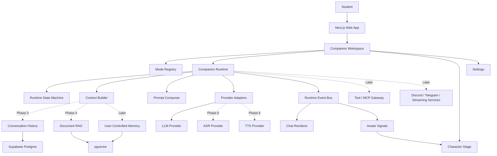

# Reference Stack Study

This document captures practical stack and architecture lessons from four local open-source companion and VTuber reference projects:

- AIRI / Project AIRI
- Sanbaka
- Open-LLM-VTuber
- Neuro

Local clone paths are intentionally not recorded here. Keep this document safe to commit: no local machine paths, no secrets, no private model files, no copied assets, and no copied implementation code.

Research date: 2026-06-26

## Executive Decision

UIT Waifu should keep the current web stack for the main product:

```txt
Next.js + React + TypeScript + Tailwind CSS + ShadCN-style components
Static export at /waifu
DirectAdmin/PHP adapter now, Cloudflare/Supabase later
```

The reference projects are strongest as architecture and product-pattern sources, not as a reason to rewrite the app today. Vue/Vite is a strong option for a future standalone character stage, desktop shell, or experimental companion runtime, but replatforming the MVP now would slow down chat, RAG, auth, and deployment progress.

## Stack Matrix

| Reference | Primary stack | Runtime shape | Strongest lesson for UIT Waifu | Use now? |
| --- | --- | --- | --- | --- |
| AIRI | pnpm monorepo, Turbo, TypeScript, Vue 3, Vite, UnoCSS, Pinia, Vue Router, Vitest, Playwright, Hono/h3/crossws-style server packages | Multi-app companion platform with web stage, desktop/tamagotchi engines, plugins, server SDK, service integrations, and model/voice packages | Keep app, runtime, plugins, services, UI packages, and integrations as separate boundaries | Use as long-term architecture reference, not MVP framework replacement |
| Sanbaka | AIRI-like pnpm/Turbo monorepo, Vue 3, Vite, UnoCSS, Drizzle, pgvector memory package, realtime audio experiments, Telegram/Discord/Minecraft services | Character-app laboratory with modular packages and service experiments | Vue/Vite gives fast character UI iteration; package boundaries are useful for future split | Use as reference for modularization and future stage shell |
| Open-LLM-VTuber | Python 3.10-3.12, FastAPI, Uvicorn, WebSocket, YAML config, modular ASR/TTS/LLM/agent factories, Live2D, VAD, MCP tools | Local/server companion backend with web/desktop clients, voice loop, Live2D expressions, chat history, provider matrix, and optional tools | Provider factories and config-driven modules are the cleanest pattern for voice/avatar/provider growth | Use heavily for Phase 5-7 planning |
| Neuro | Python 3.11, RealtimeSTT, RealtimeTTS, python-socketio, Twitch API, pyvts, ChromaDB, transformers, screenshot/multimodal modules | Realtime VTuber loop with shared signal state, prompt injection modules, memory reflection, VTube Studio control, and moderation panel | The event loop and signal model are very practical for realtime state | Use as reference for event/state design and memory controls |

## AIRI Lessons

### Observed Stack

- TypeScript-first monorepo with pnpm workspaces and Turbo.
- Vue 3 + Vite for the main web stage.
- UnoCSS and reusable UI packages for design-system scale.
- Pinia/Vue Router style client app architecture.
- Stage packages for web UI, Live2D/3D stage UI, transitions, loading screens, shared layouts, and shared pages.
- Server/runtime packages that communicate with clients through a SDK and event contracts.
- Plugin SDK and plugin protocol packages for extension authors.
- Service integrations for Telegram, Discord, Twitter-like services, Minecraft, browser extension, Home Assistant, and Claude Code style plugins.
- Voice and model tooling around XSAI, transformers, TTS, transcription, VAD, and Web Audio.
- Data and persistence experiments with Drizzle, Postgres, DuckDB WASM, local storage/indexed browser storage, and pgvector-like memory packages.
- Testing and quality with Vitest, Playwright/browser tests, typecheck scripts, linting, package publishing checks, and monorepo build orchestration.

### Architecture Lessons

- Split the product into explicit lanes:
  - `apps`: end-user surfaces.
  - `packages`: reusable UI/runtime/audio/model primitives.
  - `services`: bots, connectors, and long-running integrations.
  - `plugins`: optional capability packs.
  - `engines`: desktop or specialized runtimes.
- Make extensions talk through event contracts instead of direct imports.
- Keep a client SDK between UI/plugin code and backend runtime code.
- Treat avatar rendering as its own stage package rather than mixing it into chat logic.
- Keep model-provider code outside UI components.
- Use scenario/capture style visual checks for complex character UI.

### UIT Waifu Adaptation

For now:

- Keep Next.js for the public web app.
- Keep mode metadata and prompt composition as the first small runtime boundary.
- Add a lightweight `features/runtime` boundary before adding tools, voice, RAG, or avatar state.
- Keep ShadCN-style UI primitives local and simple.

Later:

- If the avatar stage becomes too complex for React/Next, consider a separate Vue/Vite stage package loaded as a micro-frontend or standalone route.
- If plugins become real, define a small event contract before adding plugin code.

## Sanbaka Lessons

Sanbaka is useful because it shows a Vue/Vite companion stack at a scale between a simple app and the newer AIRI platform.

### Observed Stack

- pnpm workspace and Turbo build orchestration.
- Vue 3 + Vite stage app.
- UnoCSS styling.
- Stage web app, realtime-audio app, prompt-engineering playgrounds, and tamagotchi/desktop experiments.
- Packages for audio, UI, transitions, fonts, i18n, memory, DuckDB WASM, server SDK/runtime, and prompt/component calling.
- Services for Telegram, Discord, Twitter-like flows, and Minecraft/mineflayer agents.
- Drizzle and Postgres/pgvector-oriented memory experiments.
- Workers and audio worklets for VAD and realtime audio.

### Architecture Lessons

- A "stage" app can stay focused on character presentation while other services handle bots, tools, and memory.
- Realtime audio deserves worker/worklet isolation.
- Memory should be a package/service boundary, not a random helper inside chat UI.
- Prompt engineering playgrounds are valuable once modes become complex.
- Game or external-world integrations should live behind service adapters.

### UIT Waifu Adaptation

- Do not convert the main app to Vue today.
- Borrow the concept of a future `stage` boundary:

```txt
UIT Waifu shell
  -> chat panel
  -> stage adapter
  -> runtime events
  -> avatar renderer
```

- Keep realtime audio and VAD out of the main chat component when Phase 6 starts.
- Keep memory/RAG as a separate feature package and database boundary.

## Open-LLM-VTuber Lessons

Open-LLM-VTuber is the strongest reference for a complete voice/avatar companion backend.

### Observed Stack

- Python app with FastAPI/Uvicorn server and WebSocket handling.
- YAML configuration templates copied into user config.
- Dedicated managers/factories for ASR, TTS, VAD, agents, stateless LLM providers, live integrations, and tools/MCP.
- ASR provider pattern includes local and cloud choices such as faster-whisper, whisper.cpp, OpenAI Whisper, FunASR, Azure ASR, Groq Whisper, and Sherpa ONNX.
- TTS provider pattern includes local and cloud choices such as Edge TTS, Azure TTS, OpenAI-compatible TTS, ElevenLabs, Cartesia, Fish Audio, Coqui, CosyVoice, GPT-SoVITS, Melo, Bark, Piper, pyttsx3, and Sherpa ONNX.
- LLM provider pattern includes OpenAI-compatible providers, Claude, Ollama, llama.cpp, and local/server options.
- Agent choices include a basic memory agent and integrations such as Mem0, Hume AI, and Letta.
- Live2D model handling and expression extraction are first-class avatar concerns.
- Web tool exposes initialized ASR/TTS models for direct testing.
- Chat history and conversation handlers are separate from provider code.
- Bilibili/live integration and MCP tools are optional modules.

### Architecture Lessons

- Factories are useful when provider count is large, but they should not appear too early.
- Config-driven provider selection works well for advanced local users.
- Voice systems need a pipeline, not one endpoint:

```txt
audio input
  -> VAD
  -> ASR
  -> conversation agent
  -> TTS preprocessing
  -> TTS
  -> audio stream
  -> avatar expression / mouth state
```

- Expression and speech are separate outputs from the agent.
- Tool/MCP support should be gated and explicit.
- Desktop/pet mode is a later runtime, not a Phase 1 feature.

### UIT Waifu Adaptation

Phase 3-4:

- Keep conversation history and RAG separate from provider code.
- Add source-aware document context before any voice work.

Phase 5:

- Add avatar expression state as a structured side channel.
- Keep avatar assets and renderer optional.

Phase 6:

- Start with browser speech recognition and a simple transcript preview.
- Add VAD/TTS only after text chat, history, and document RAG are stable.

Phase 7+:

- If local/offline mode matters, use provider factories like Open-LLM-VTuber.

## Neuro Lessons

Neuro is the strongest compact reference for a realtime VTuber loop.

### Observed Stack

- Python application built around separate files/classes for STT, TTS, LLM wrappers, prompting, VTube Studio, Twitch, memory, multimodal input, and frontend socket control.
- RealtimeSTT for streaming speech recognition.
- RealtimeTTS with Coqui/XTTS-style voice output.
- OpenAI-compatible LLM endpoint through text-generation-webui or similar local model server.
- python-socketio for a control panel frontend.
- Twitch API integration for stream chat.
- pyvts for VTube Studio model and hotkey control.
- ChromaDB for persistent vector memory.
- Screenshot/multimodal module for visual context.
- Shared `Signals` object coordinates human speaking, AI speaking, AI thinking, recent Twitch messages, history, readiness, and termination.
- `Prompter` decides when to prompt based on readiness, speaking state, new messages, chat messages, and idle patience.
- Modules can expose prompt injections with priorities.
- Memory module retrieves relevant memories and periodically generates short-term memories from recent conversation.
- Control panel can toggle LLM/TTS/STT, clear memories, update blacklist, trigger hotkeys, play audio, and nuke history.

### Architecture Lessons

- Realtime companion state should be explicit and inspectable:

```txt
human_speaking
assistant_thinking
assistant_speaking
last_message_time
new_message
recent_external_messages
history
ready_flags
```

- Prompting should be decided by a coordinator, not scattered across UI callbacks.
- Prompt injections need priorities and clear cleanup.
- Memory must have create, delete, import, export, clear-short-term, and wipe controls.
- Moderation/control panel features matter before public stream integrations.
- Multimodal features should be opt-in because they increase privacy and safety risk.

### UIT Waifu Adaptation

- Add explicit chat/runtime state before voice:

```txt
idle
listening
thinking
streaming_text
speaking
error
```

- Keep "stop generation" and "clear conversation" as first-class controls.
- Before long-term memory, add user-visible delete/export controls.
- Do not add Twitch/streaming integrations until the web app has auth, history, safety, and rate limits.

## Target UIT Waifu Architecture From This Study



## Recommended Internal Boundaries

These are not all needed today. Add them only when the next phase needs them.

```txt
data/modes.ts
  Mode registry, starter prompts, runtime metadata.

lib/prompts/*
  Versioned prompt layers.

features/chat/*
  Browser chat state, input, local session persistence.

features/runtime/*
  Future state machine, event bus, context builder, provider-neutral response events.

features/avatar/*
  Future expression parsing, mood mapping, avatar signal state.

features/documents/*
  Future upload, extraction, chunking, retrieval.

lib/ai/*
  Provider adapters and normalized streaming.

lib/memory/*
  Future user-controlled memory, separate from document RAG.

services/*
  Later external integrations only after web core is stable.
```

## Borrow Now

1. Keep mode metadata as the small runtime registry.
2. Add explicit state names for chat/avatar UI.
3. Keep provider adapters normalized and secret-safe.
4. Document all prompt changes.
5. Treat memory/RAG as user-visible features with controls.
6. Use visual smoke tests for stage/chat layout.

## Borrow Later

1. A plugin/event contract once tools and integrations are real.
2. Provider factories once there are several ASR/TTS/local model backends.
3. Realtime audio workers for VAD, ASR streaming, and TTS playback.
4. A separate stage renderer if Live2D/VRM becomes too heavy for the main shell.
5. Desktop/pet mode only after the web companion is useful.

## Do Not Borrow Yet

- Full Vue/Vite rewrite of the main product.
- Monorepo complexity before the app has auth, history, and RAG.
- Twitch, Discord, Minecraft, or public streaming integrations.
- Always-listening voice.
- Autonomous tool execution.
- Local GPU model requirements.
- Reference project assets, model files, voices, secrets, personal configs, or local filesystem paths.

## Phase Mapping

| UIT Waifu phase | Reference influence | Practical next step |
| --- | --- | --- |
| Phase 1: Chat MVP | AIRI/Sanbaka UI ergonomics, Neuro control clarity | Keep chat fast, readable, and safe |
| Phase 2: Modes | AIRI mode/runtime boundaries, Neuro prompt injections | Keep improving mode registry, prompts, and response contracts |
| Phase 3: Auth/history | Neuro memory controls, AIRI service boundaries | Add conversations/messages tables and delete/export controls |
| Phase 4: Document RAG | Neuro Chroma memory, Sanbaka pgvector memory, AIRI data packages | Implement upload, chunking, embeddings, pgvector retrieval, source snippets |
| Phase 5: Avatar UI | AIRI stage packages, Open-LLM-VTuber Live2D expressions | Add structured avatar state and expression mapping |
| Phase 6: Voice | Open-LLM-VTuber ASR/TTS factories, Neuro realtime loop | Start with push-to-talk and transcript preview |
| Phase 7: Live2D/VRM | AIRI/TresJS/Three/Live2D, Open-LLM-VTuber Live2D model handling | Keep renderer optional and code-split |
| Phase 8: Integrations | AIRI services, Neuro Twitch control, Open-LLM-VTuber live modules | Add only behind auth, settings, moderation, and rate limits |

## Stack Decision Notes

### Keep Next.js For The Main App

The existing app already has:

- Static export and deployed `/waifu` base path.
- React chat components.
- Tailwind/ShadCN-style UI primitives.
- Prompt and mode tests.
- DirectAdmin PHP adapter.

Next.js is still the shortest path to finish the academic companion MVP.

### Use Vue/Vite As A Future Stage Option

Vue/Vite becomes attractive if:

- The avatar/stage becomes an independent app.
- We need heavy Live2D/VRM tooling that is easier to isolate.
- Desktop/pet mode becomes a separate runtime.
- We need a fast visual playground for character interactions.

Until then, do not split the frontend.

### Use Python Only For Heavy Voice/Local Runtime

Python becomes attractive if:

- We need local Whisper/Faster-Whisper/Sherpa ASR.
- We need local TTS or voice cloning.
- We need local GPU inference.
- We need a long-running realtime loop with audio devices.

Until then, keep the web app provider-based and lightweight.
